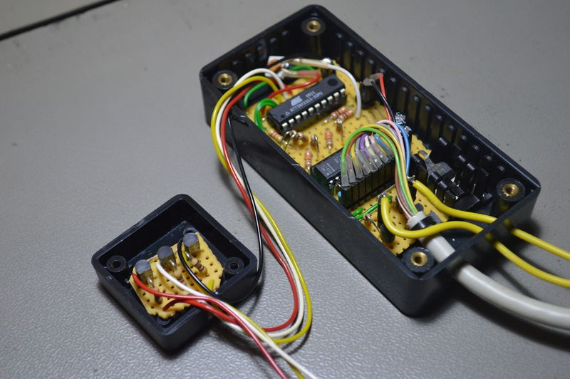

## Source code for project: [Car front lights controller](https://link.stdout.no/c)

This unit is used for controlling additional car headlights, such as high beams and fog/running lights. Uses an AVR ATtiny2313 microcontroller.

Written in basic, using [Bascom-AVR](http://www.mcselec.com/).

### Author
[Thomas Jensen](https://thomas.stdout.no)
